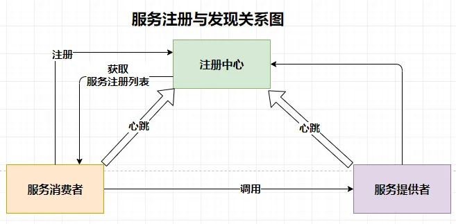

# SweetRPC
SweetRPC只是一个玩具级的RPC框架，未经实际线上检验，请大家不要使用（有问题不负责），
but，SweetRPC是一个学习RPC框架的好轮子，因为它足够简单，但是麻雀虽小五脏俱全。
## 服务注册&服务发现（etcd、zk、nacos、consul）
服务发现&服务注册在微服务框架中起着承上启下的作用，是微服务框架中十分重要的一环，
没有服务发现&服务注册整个框架都没有办法run

在实现服务发现和服务注册当中我们通常会选择以下组件来实现
- [X] ETCD
- [ ] ZK
- [ ] nacos
- [ ] consul

因为SweetRPC框架是Go语言实现的轮子，所以我们暂且先选着ETCD实现，虽然我个人认为ETCD并不是
实现服务发现&服务注册最优的组件（AP组件可能会好点），如果有人想实现其它组件可以提PR。推荐一篇 
各组件对比的文章[https://mp.weixin.qq.com/s/MGmbAz41zJGXwyPrmEeRBw](https://mp.weixin.qq.com/s/MGmbAz41zJGXwyPrmEeRBw)

## 传输协议（http、http2、tcp、quic）
- [ ] http
- [ ] http2
- [ ] tcp
- [ ] quic
## 数据序列化（json、pb、msgpack）
- [ ] json
- [ ] pb
- [ ] msgpack
## 数据压缩

## 服务治理
### 数据可观测性（logging、metric、trace）
- [X] logging
- [ ] metric
- [ ] trace
### 熔断
- [ ] 熔断
### 限流（滑动窗口、漏斗、令牌桶）
- [ ] 滑动窗口
- [ ] 漏斗
- [ ] 令牌桶
### 负载均衡
- [X] rr
- [ ] wrr
- [ ] p2c
- [X] random
### 重试
- [ ] Failfast
- [ ] Failover
- [ ] Failtry
- [ ] Failbackup

## 使用
