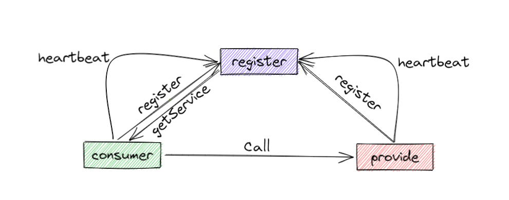

# srpc
srpc只是一个玩具级的RPC框架，未经线上实际检验，请大家不要轻易使用（有问题概不负责哦），
but，srpc是一个学习RPC框架的“好轮子”（王婆卖瓜自卖自夸，hhh），因为它足够简单，麻雀虽小五脏俱全。

## 服务注册&服务发现（etcd、zk、nacos、consul）
服务发现&服务注册在微服务框架中起着承上启下的作用，是微服务框架中十分重要的一环，
如果在微服务体系当中没有服务发现&服务注册，那么就像汽车没有方向盘，无法掌控前进的方向。



在实现服务发现和服务注册当中我们通常会选择以下组件来实现
- [X] ETCD
- [ ] ZK
- [ ] nacos
- [ ] consul

因为srpc框架是Go语言实现的轮子，所以我们暂且先选择ETCD（Go语言实现）来实现服务发发现，虽然我个人认为ETCD并不是
实现服务发现&服务注册最优的组件（AP组件可能会好点），如果有人想实现其它组件可以提PR。推荐一篇 
各组件对比的文章[https://mp.weixin.qq.com/s/MGmbAz41zJGXwyPrmEeRBw](https://mp.weixin.qq.com/s/MGmbAz41zJGXwyPrmEeRBw)

## 传输协议（http、http2、tcp、quic）
- [ ] http
- [ ] http2
- [X] tcp
- [ ] quic
- [X] udp
## 数据序列化（json、pb、msgpack）
- [X] json
- [X] pb
- [X] msgpack
## 数据压缩

## 服务治理
### 数据可观测性（logging、metric、trace）
- [X] logging
- [ ] metric
- [X] trace
### 熔断
- [ ] 熔断
### 限流（滑动窗口、漏斗、令牌桶）
- [ ] 滑动窗口
- [ ] 漏斗
- [ ] 令牌桶
### 负载均衡
- [X] rr
- [ ] wrr
- [ ] p2c
- [X] random
### 重试
- [ ] Failfast
- [ ] Failover
- [ ] Failtry
- [ ] Failbackup
### 超时控制
- [X] 级联超时控制

## 服务端

## 客户端

## TODOLIST
- 实现客户端异步请求方式
- 实现基于proto的插件来生成客户端和服务端的脚手架
- 实现Unix Domain Socket的通信方式
- 实现P2C的负载均衡方式
- 实现长连接subset子集划分
- 实现《The Tail at Scale》论文上优化长尾耗时的一些方法？？
- 优化现有代码风格，增强健壮性
- .........

## 使用

### server


server.go

```go
package main

import (
	"context"
	"errors"
	"fmt"
	
	"github.com/wsx864321/srpc/discov/etcd"
	"github.com/wsx864321/srpc/server"
)


type HelloWorld struct {
}

type HelloWorldReq struct {
	Name string `json:"name"`
}

type HelloWorldResp struct {
	Msg string `json:"msg"`
}

func (h *HelloWorld) SayHello(ctx context.Context, req *HelloWorldReq) (*HelloWorldResp, error) {
	return &HelloWorldResp{
		Msg: fmt.Sprintf("%s say hello", req.Name),
	}, nil
}

func main() {
    s := server.NewServer(server.WithDiscovery(etcd.NewETCDRegister(etcd.WithEndpoints([]string{"127.0.0.1:2371"}))))
    s.RegisterService("helloworld", &HelloWorld{})
    s.Start()
}

```

client.go

```go
package main

import (
	"context"
	"fmt"
	"time"

	"github.com/wsx864321/srpc/client"
	"github.com/wsx864321/srpc/discov/etcd"
)

type HelloWorldReq struct {
	Name string `json:"name"`
}

type HelloWorldResp struct {
	Msg string `json:"msg"`
}

func main() {
	req := &HelloWorldReq{
		Name: "wsx",
	}
	var resp HelloWorldResp
	ctx, _ := context.WithTimeout(context.TODO(), 2*time.Second)
	cli := client.NewClient(client.WithServiceName("helloworld"), client.WithDiscovery(etcd.NewETCDRegister(etcd.WithEndpoints([]string{"127.0.0.1:2371"}))))
	err := cli.Call(ctx, "SayHello", req, &resp)
	fmt.Println(resp, err)
}
```